# Configuration Management With Helm

> Automating the CI/CD pipeline of a sample web application using Jenkins, Helm, EKS, ECR, and Terraform on AWS.

---


## Project Overview

This project demonstrates how to build, package, and deploy a containerized web application using **Docker**, **AWS ECR**, **Helm**, and **Jenkins CI/CD pipeline**. The application is deployed to an **Amazon EKS** (Elastic Kubernetes Service) cluster using **Helm charts**.

---


## Architecture

```
+----------------+      +------------------+      +--------------------+
|   Developer    | ---> |   GitHub Repo    | ---> |   Jenkins EC2 VM   |
+----------------+      +------------------+      +---------+----------+
                                                     |
                                                     v
                                              Docker Build + Push
                                                to Amazon ECR
                                                     |
                                                     v
                                             Helm Deploy to EKS
                                                     |
                                                     v
                                               App Live on EKS

```

---


## Features
+ Jenkins auto-installs with Helm, Docker, kubectl

+ EC2 and EKS infrastructure provisioned with Terraform

+ CI/CD pipeline triggered on GitHub push

+ Docker images pushed to Amazon ECR

+ Helm chart templates deployed to EKS

+ Credentials and security scoped for DevOps best practices


---


## Project Structure
```
MY-FIRST-CHART/
│
├── img/
├── jenkins-ami/
│   ├── packer.pkr.hcl
│   └── setup.sh
├── my-app/
│   └── helm/
│       └── webapp/
│           ├── templates/
│           ├── .helmignore
│           ├── Chart.yaml
│           └── values.yaml
├── public/
│   └── index.html
├── Dockerfile
├── Jenkinsfile
├── terraform/
├── .dockerignore
├── .gitignore
└── README.md
```

---


## Tools & Technologies

- **Jenkins** – Automates the build, test, and deployment steps.
- **Helm** – Kubernetes package manager used for managing Kubernetes applications.
- **Docker** – Containerization of the application.
- **Amazon ECR** – Docker image repository.
- **Amazon EKS** – Managed Kubernetes cluster.
- **GitHub** – Source code repository.
---


## Step-by-Step Guide

### Create project directory
```
mkdir my-first-chart
cd my-first-chart
```


## Install Packer on Windows
```
choco install packer
packer version
```


## Create Folder for Jenkins Ami
+ Create directory
+ Paste the inside setup.sh.

```
mkdir jenkins-ami && cd jenkins-ami
touch setup.sh
```

**Paste**
```
#!/bin/bash
set -e
exec > >(tee /tmp/setup.log|logger -t user-data -s 2>/dev/console) 2>&1

echo "Updating packages..."
sudo apt-get update -y && sudo apt-get upgrade -y

# 1. Java
echo "Installing Java..."
sudo add-apt-repository universe -y
sudo add-apt-repository multiverse -y
sudo apt-get update -y
sudo apt install openjdk-17-jre -y
java -version || { echo "Java installation failed!"; exit 1; }

# 2. Jenkins
echo "Installing Jenkins..."
curl -fsSL https://pkg.jenkins.io/debian-stable/jenkins.io-2023.key | sudo tee \
    /usr/share/keyrings/jenkins-keyring.asc > /dev/null
echo deb [signed-by=/usr/share/keyrings/jenkins-keyring.asc] \
    https://pkg.jenkins.io/debian-stable binary/ | sudo tee \
    /etc/apt/sources.list.d/jenkins.list > /dev/null
sudo apt-get update
sudo apt-get install jenkins -y
sudo chown -R jenkins:jenkins /var/lib/jenkins
sudo systemctl enable jenkins
sudo systemctl start jenkins
sudo systemctl status jenkins || { echo "Jenkins failed to start!"; exit 1; }

# 3. Docker
echo "Installing Docker..."
sudo apt-get install ca-certificates curl gnupg -y
sudo install -m 0755 -d /etc/apt/keyrings
curl -fsSL https://download.docker.com/linux/ubuntu/gpg | sudo gpg --dearmor -o /etc/apt/keyrings/docker.gpg
sudo chmod a+r /etc/apt/keyrings/docker.gpg
echo \
  "deb [arch=$(dpkg --print-architecture) signed-by=/etc/apt/keyrings/docker.gpg] https://download.docker.com/linux/ubuntu \
  $(. /etc/os-release && echo "$VERSION_CODENAME") stable" | \
  sudo tee /etc/apt/sources.list.d/docker.list > /dev/null
sudo apt-get update
sudo apt-get install docker-ce docker-ce-cli containerd.io docker-buildx-plugin docker-compose-plugin -y
docker --version || { echo "Docker installation failed!"; exit 1; }

sudo usermod -aG docker ubuntu
sudo usermod -aG docker jenkins

# 4. AWS CLI
echo "Installing AWS CLI..."
curl "https://awscli.amazonaws.com/awscli-exe-linux-x86_64.zip" -o "awscliv2.zip"
sudo apt install unzip -y
unzip awscliv2.zip || { echo "Unzip failed"; exit 1; }
sudo ./aws/install
aws --version
rm -rf aws awscliv2.zip

# 5. Helm
echo "Installing Helm..."
curl -LO https://get.helm.sh/helm-v3.14.2-linux-amd64.tar.gz
tar -zxvf helm-v3.14.2-linux-amd64.tar.gz
sudo install -m 755 linux-amd64/helm /usr/local/bin/helm
rm -rf linux-amd64 helm-v3.14.2-linux-amd64.tar.gz
helm version || { echo "Helm installation failed!"; exit 1; }

# 6. Kubectl
echo "Installing kubectl..."
curl -LO "https://dl.k8s.io/release/$(curl -sL https://dl.k8s.io/release/stable.txt)/bin/linux/amd64/kubectl"
sudo install -o root -g root -m 0755 kubectl /usr/local/bin/kubectl
kubectl version --client

echo "Jenkins + Docker + Helm + kubectl are installed"
```

+ Make it executable:
```
chmod +x setup.sh 
```


## Create the Packer Template
+ Create a Packer template file called packer.pkr.hcl:
```
touch packer.pkr.hcl
```

**Paste:**
```
packer {
  required_plugins {
    amazon = {
      version = ">= 1.0.0"
      source  = "github.com/hashicorp/amazon"
    }
  }
}

variable "aws_region" {
  default = "us-east-1"
}

variable "source_ami" {
  default = "ami-0f9de6e2d2f067fca"
}

variable "instance_type" {
  default = "t2.medium"
}

source "amazon-ebs" "jenkins" {
  region                      = var.aws_region
  source_ami                  = var.source_ami
  instance_type               = var.instance_type
  ssh_username                = "ubuntu"
  ami_name                    = "jenkins-ami-{{timestamp}}"
  associate_public_ip_address = true
  communicator                = "ssh"
}

build {
  name = "jenkins-ami"

  sources = [
    "source.amazon-ebs.jenkins"
  ]

  provisioner "file" {
    source      = "setup.sh"
    destination = "/tmp/setup.sh"
  }

  provisioner "shell" {
    inline = [
      "chmod +x /tmp/setup.sh",
      "sudo /tmp/setup.sh"
    ]
  }
}
```

## Build Your AMI
+ Verify AWS CLI configuration

**Run**
```
aws configure
packer init .
packer validate packer.pkr.hcl
packer build packer.pkr.hcl
```
Once the process is complete, Packer will give you the ID of the new AMI, which you can then use to launch EC2 instances with Jenkins, Docker, Helm, kubectl, and AWS CLI pre-installed.

**go to your AWS Console → EC2 → AMIs to see new AMI ID**
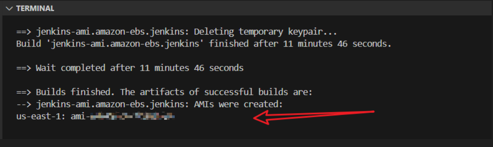


### Create .gitignore

Create a .gitignore file in the root of your project:

 ```
 touch .gitignore
 ```

#### Paste the following into it:
```
# Terraform
*.tfstate
*.tfstate.*
.terraform/
.crash
*.tfvars
*.tfvars.json
override.tf
override.tf.json
terraform.tfstate.backup
.terraform.lock.hcl

# Packer
packer_cache/
*.pkr.hcl.lock
*.pkrvars.hcl
setup-debug.log

# User data scripts
*.log
*.zip
*.bak

# System
.DS_Store
Thumbs.db

# IDEs/editors
.vscode/
.idea/
*.swp
*.swo

# Credentials
*.pem
*.key
.aws/
```


### Git initialization and Push:

+ Create a repo on github

```
git init
git add .gitignore
git add .
git commit -m "Initial project setup with Terraform"
git branch -m master main
git remote add origin https://github.com/yourusername/your-repository.git
git push -u origin main
git status
```


### Step 1: Use Terraform to Set Up AWS Resources
+ Create project folders
+ AWS CLI installed + configured
+ verify terraform installation

```
cd ..
mkdir terraform
cd terraform
aws configure
terraform -v
```
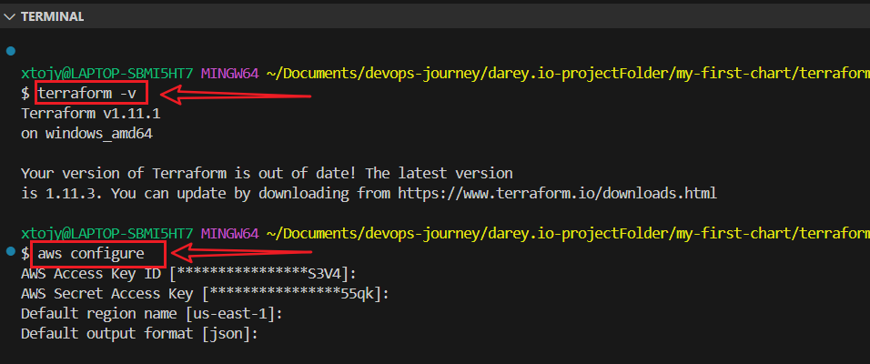


### Create terraform/main.tf
```
touch ec2.tf
```
```
resource "aws_instance" "jenkins" {
  ami                         = "ami-xxxxxxx"
  instance_type               = "t3.medium"
  subnet_id                   = module.vpc.public_subnets[0]
  associate_public_ip_address = true
  key_name                    = "main-key"
  user_data                   = file("jenkins/configure_jenkins.sh")

  tags = {
    Name = "Jenkins-Server"
  }

  vpc_security_group_ids = [aws_security_group.jenkins_sg.id]
}

resource "aws_security_group" "jenkins_sg" {
  name        = "jenkins_sg"
  description = "Allow SSH and Jenkins"
  vpc_id      = module.vpc.vpc_id

  ingress {
    from_port   = 22
    to_port     = 22
    protocol    = "tcp"
    cidr_blocks = ["0.0.0.0/0"]
  }

  ingress {
    from_port   = 80
    to_port     = 80
    protocol    = "tcp"
    cidr_blocks = ["0.0.0.0/0"]
  }

  ingress {
    from_port   = 8080
    to_port     = 8080
    protocol    = "tcp"
    cidr_blocks = ["0.0.0.0/0"]
  }

  egress {
    from_port   = 0
    to_port     = 0
    protocol    = "-1"
    cidr_blocks = ["0.0.0.0/0"]
  }
}
```

### terraform/ecr.tf
```
touch ecr.tf
```
```
resource "aws_ecr_repository" "web_app" {
  name = "web-app-repo"
}
```

### terraform/eks.tf
```
touch eks.tf
```
```
module "eks" {
  source  = "terraform-aws-modules/eks/aws"
  version = "19.15.3"

  cluster_name    = "my-eks-cluster"
  cluster_version = "1.29"

  vpc_id     = module.vpc.vpc_id
  subnet_ids = module.vpc.private_subnets

  cluster_enabled_log_types    = []
  create_cloudwatch_log_group = false
  cluster_endpoint_public_access  = true
  cluster_endpoint_private_access = true

  eks_managed_node_groups = {
    default = {
      desired_size   = 2
      max_size       = 3
      min_size       = 1
      instance_types = ["t3.medium"]
    }
  }

  tags = {
    Terraform   = "true"
    Environment = "dev"
  }
}
```


### terraform/vpc.tf
```
touch vpc
```
```
module "vpc" {
  source  = "terraform-aws-modules/vpc/aws"
  version = "5.1.1" 

  name = "capstone-vpc"
  cidr = "10.0.0.0/16"

  azs             = ["us-east-1a", "us-east-1b"]
  private_subnets = ["10.0.1.0/24", "10.0.2.0/24"]
  public_subnets  = ["10.0.3.0/24", "10.0.4.0/24"]

  enable_nat_gateway = true
  single_nat_gateway = true
  enable_dns_hostnames = true

  tags = {
    Name        = "capstone-vpc"
    Environment = "dev"
  }
}
```


### terraform/output.tf
touch output.tf
```
output "cluster_name" {
  value = module.eks.cluster_name
}

output "kubeconfig_command" {
  value = "aws eks --region us-east-1 update-kubeconfig --name ${module.eks.cluster_name}"
}

output "jenkins_instance_public_ip" {
  value = aws_instance.jenkins.public_ip
}

output "ecr_repository_url" {
  value = aws_ecr_repository.web_app.repository_url
}

output "vpc_id" {
  value = module.vpc.vpc_id
}
```

### terraform/provider.tf
touch provider.tf
```
provider "aws" {
  region = "us-east-1"
}
```


### terraform/variable.tf
touch variable.tf
```
variable "region" {
  default = "us-east-1"
}

variable "vpc_cidr_block" {
  default = "10.0.0.0/16"
}

variable "instance_type" {
  default = "t2.medium"
}

variable "key_name" {
  default = "your-key-pair"
}
```

----


### Ensure the AWS IAM user (or role) has these permissions:

+ Attach this policy:

**Paste**
```
{
  "Version": "2012-10-17",
  "Statement": [
    {
      "Effect": "Allow",
      "Action": [
        "ecr:GetAuthorizationToken",
        "ecr:BatchCheckLayerAvailability",
        "ecr:PutImage",
        "ecr:InitiateLayerUpload",
        "ecr:UploadLayerPart",
        "ecr:CompleteLayerUpload",
        "ecr:DescribeRepositories"
      ],
      "Resource": "*"
    }
  ]
}
```


## Create Jenkinsfile

**Paste**
```
pipeline {
  agent any

  environment {
    AWS_REGION    = 'us-east-1'
    ECR_ACCOUNT   = '<account-id>'
    ECR_REPO      = "${ECR_ACCOUNT}.dkr.ecr.${AWS_REGION}.amazonaws.com/my-webapp"
    IMAGE_TAG     = 'latest'
    CLUSTER_NAME  = 'my-eks-cluster'
    HELM_RELEASE  = 'webapp'
    HELM_CHART    = './helm/webapp'
  }

  triggers {
    githubPush()
  }

  stages {
    stage('Checkout') {
      steps {
        git 'https://github.com/username/my-first-chart.git'
      }
    }

    stage('Build Docker Image') {
      steps {
        sh "docker build -t $ECR_REPO:$IMAGE_TAG ."
      }
    }

    stage('Login & Push to ECR') {
      steps {
        withCredentials([usernamePassword(credentialsId: 'aws-credentials',
                                          usernameVariable: 'AWS_ACCESS_KEY_ID',
                                          passwordVariable: 'AWS_SECRET_ACCESS_KEY')]) {
          sh '''
            export AWS_ACCESS_KEY_ID=$AWS_ACCESS_KEY_ID
            export AWS_SECRET_ACCESS_KEY=$AWS_SECRET_ACCESS_KEY
            aws configure set region $AWS_REGION
            aws ecr get-login-password --region $AWS_REGION | docker login --username AWS --password-stdin $ECR_ACCOUNT.dkr.ecr.$AWS_REGION.amazonaws.com
            docker push $ECR_REPO:$IMAGE_TAG
          '''
        }
      }
    }

    stage('Deploy with Helm to EKS') {
      steps {
        withCredentials([usernamePassword(credentialsId: 'aws-credentials',
                                          usernameVariable: 'AWS_ACCESS_KEY_ID',
                                          passwordVariable: 'AWS_SECRET_ACCESS_KEY')]) {
          sh '''
            export AWS_ACCESS_KEY_ID=$AWS_ACCESS_KEY_ID
            export AWS_SECRET_ACCESS_KEY=$AWS_SECRET_ACCESS_KEY
            aws eks update-kubeconfig --name $CLUSTER_NAME --region $AWS_REGION
            helm upgrade --install $HELM_RELEASE $HELM_CHART \
              --set image.repository=$ECR_REPO \
              --set image.tag=$IMAGE_TAG
          '''
        }
      }
    }
  }
}
```


## Create Dockerfile
```
mkdir my-app
nano Dockerfile 
```

**Paste**
```
# Dockerfile
FROM nginx:alpine
COPY ./public /usr/share/nginx/html
EXPOSE 80
CMD ["nginx", "-g", "daemon off;"]
```

## Create .dockerignore File

**Paste**
```
*.tar
*.zip
*.log
node_modules
.vscode
.git
*.lz4
```

### Create Jenkinsfile
```
nano jenkinsfile
```

paste
```

```

### Create Jenkins file and directory 
terraform/ec2.tf/jenkins/configure.sh
```
touch jenkins/configure_jenkins.sh
```

### Paste
```
#!/bin/bash
set -euo pipefail

REGION="us-east-1"
CLUSTER_NAME="capstone-eks"
JENKINS_HOME="/var/lib/jenkins"
JENKINS_USER="jenkins"
KUBE_DIR="${JENKINS_HOME}/.kube"
KUBECONFIG_FILE="${KUBE_DIR}/config"

# Ensure running as root
if [[ "$EUID" -ne 0 ]]; then
  echo "[ERROR] Please run as root"
  exit 1
fi

# Ensure required tools are installed
command -v aws >/dev/null 2>&1 || { echo "[ERROR] aws CLI not found"; exit 1; }
command -v kubectl >/dev/null 2>&1 || { echo "[ERROR] kubectl not found"; exit 1; }

setup_jenkins_kubeconfig() {
  echo "[INFO] Setting up kubeconfig for Jenkins..."
  aws eks update-kubeconfig --region "$REGION" --name "$CLUSTER_NAME"

  mkdir -p "$KUBE_DIR"
  cp -f /root/.kube/config "$KUBECONFIG_FILE"
  chown -R "$JENKINS_USER:$JENKINS_USER" "$KUBE_DIR"

  if ! grep -q "KUBECONFIG=${KUBECONFIG_FILE}" /etc/default/jenkins; then
    echo "KUBECONFIG=${KUBECONFIG_FILE}" >> /etc/default/jenkins
  fi

  if systemctl is-active --quiet jenkins; then
    systemctl restart jenkins
    echo "[INFO] Jenkins restarted."
  else
    echo "[WARN] Jenkins service not running or systemd not available."
  fi

  echo "[INFO] Jenkins setup complete."
}

cleanup_k8s_resources() {
  echo "[INFO] Starting safe Kubernetes cleanup..."
  aws eks update-kubeconfig --region "$REGION" --name "$CLUSTER_NAME"

  kubectl delete ingress --all || true
  kubectl delete service --all || true
  kubectl delete deployment --all || true
  kubectl delete statefulset --all || true
  kubectl delete pvc --all || true

  echo "[INFO] Kubernetes cleanup complete."
}

if [[ "${1:-}" == "--cleanup" ]]; then
  cleanup_k8s_resources
else
  setup_jenkins_kubeconfig
fi
```


### Make the Shell Script Executable
In your terminal, navigate to the root of your Terraform project, then run:
```
chmod +x jenkins/configure_jenkins.sh

```


### Initialize and Apply
```
terraform init
terraform validate
terraform plan   
terraform apply 
```

----

## Open Jenkins Dashboard

+ Verify Installation on Jenkins EC2:
```
aws --version
helm version
kubectl version --client
docker --version
jenkins --version
```
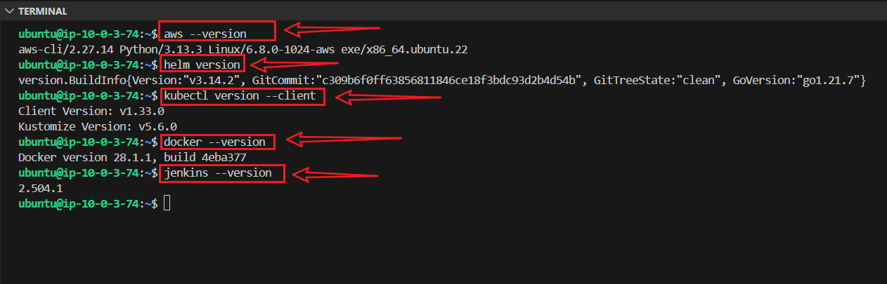


+ Open your web browser and go to:
```
http://<JENKINS_PUBLIC_IP>:8080
```

+ You’ll see a page asking for a secret password.

+ Get it from your terminal:

```
sudo cat /var/lib/jenkins/secrets/initialAdminPassword
```
+ Paste it into the Jenkins UI (browser)

+ Choose “Install suggested plugins”

+ Create admin user (or skip)

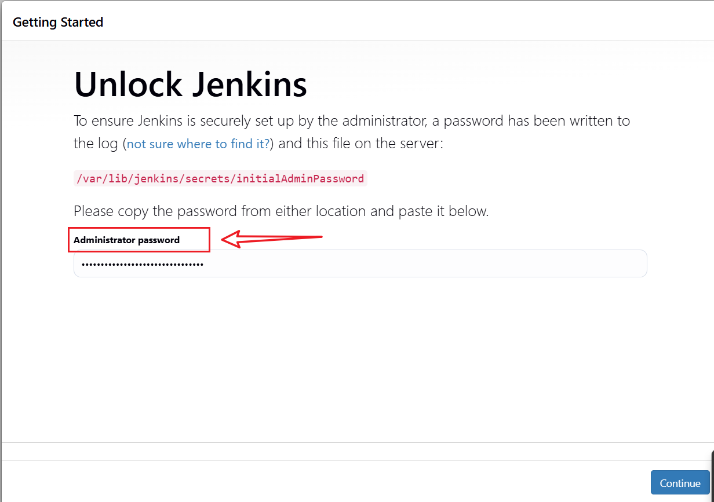
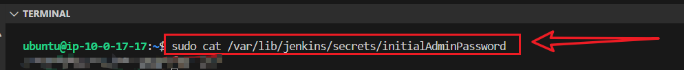
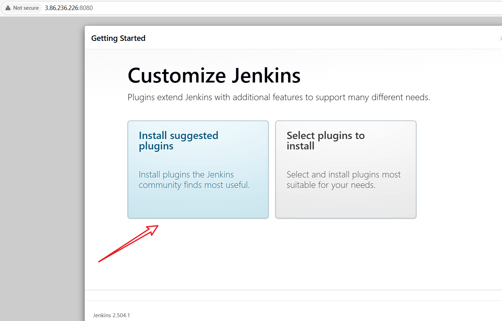
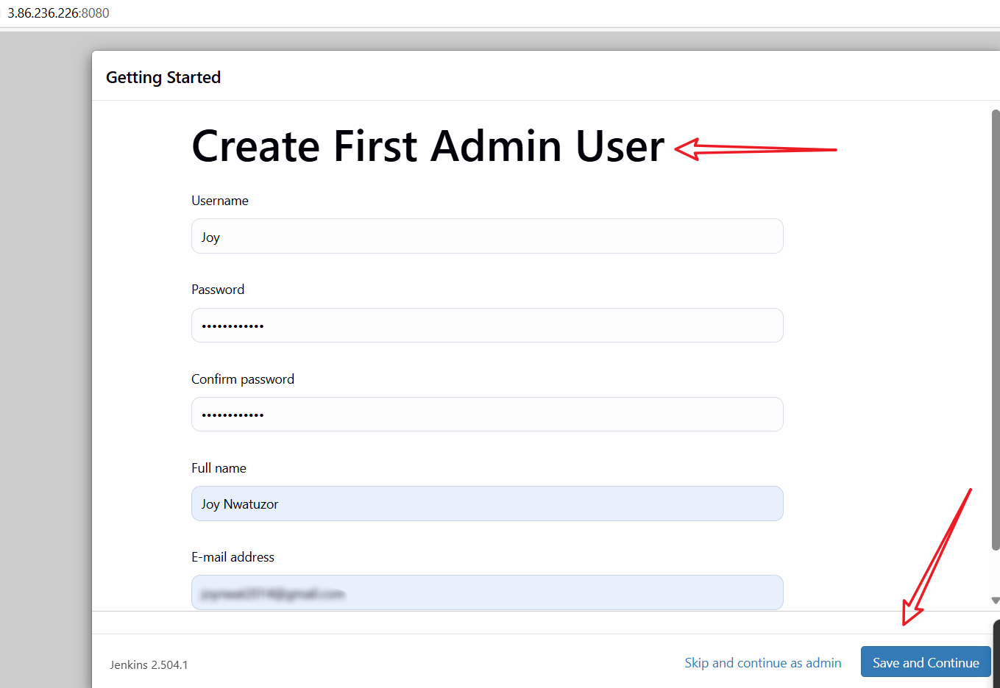
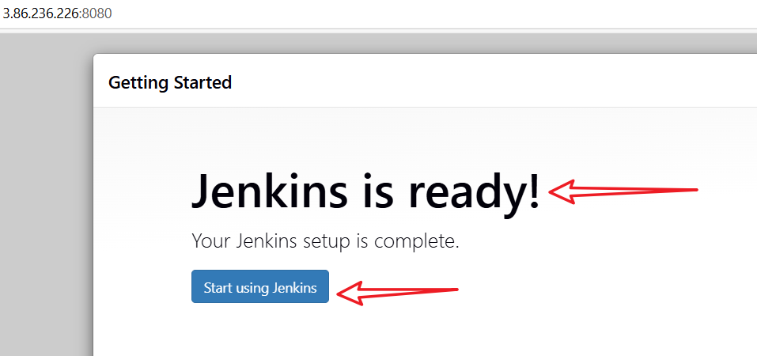


## Essential Plugins to Install:
🔹 Install Plugins in Jenkins

+ Go to Manage Jenkins → Plugins → Available Plugins 

+ Search and install these plugins:

+ Git Plugin (for Git integration)

+ Pipeline Plugin (for CI/CD automation)

+ Docker Commons

+ Kubernetes CLI Plugin (for Helm & Kubernetes)

+ Helm Plugin (for Helm chart deployments)

+ AWS Credentials

+ AWS Steps Plugin"

+ Credentials Binding Plugin (for secure credentials management)
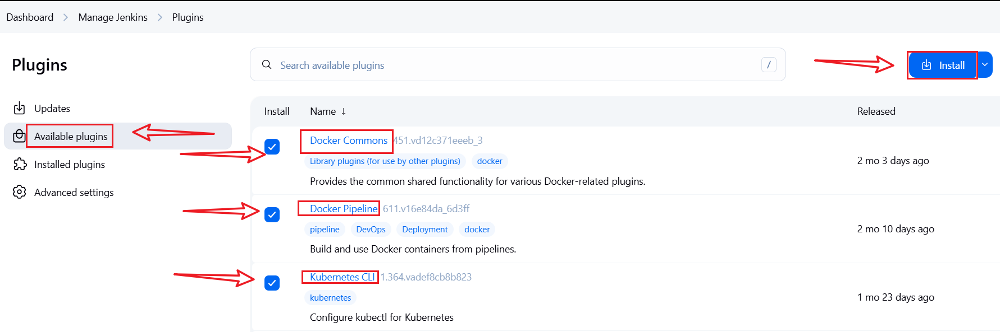
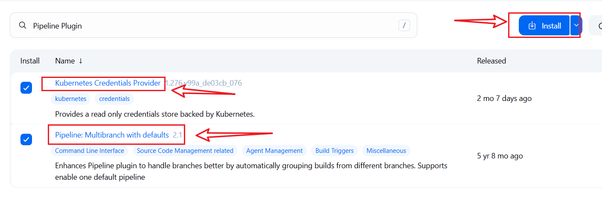
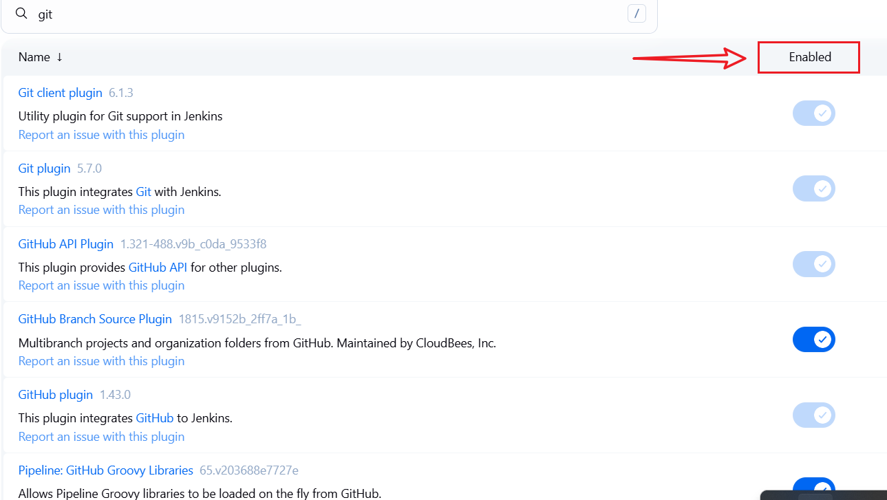
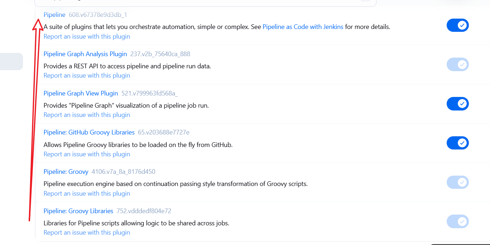


### Restart Jenkins after installing plugins:

```
sudo systemctl restart jenkins
sudo systemctl status jenkins
```


## Create a New User

+ Go to Manage Jenkins > Configure Global Security

+ Create a new admin user.

+ Disable "Allow anonymous read access.                                                                 
+ Save your changes.

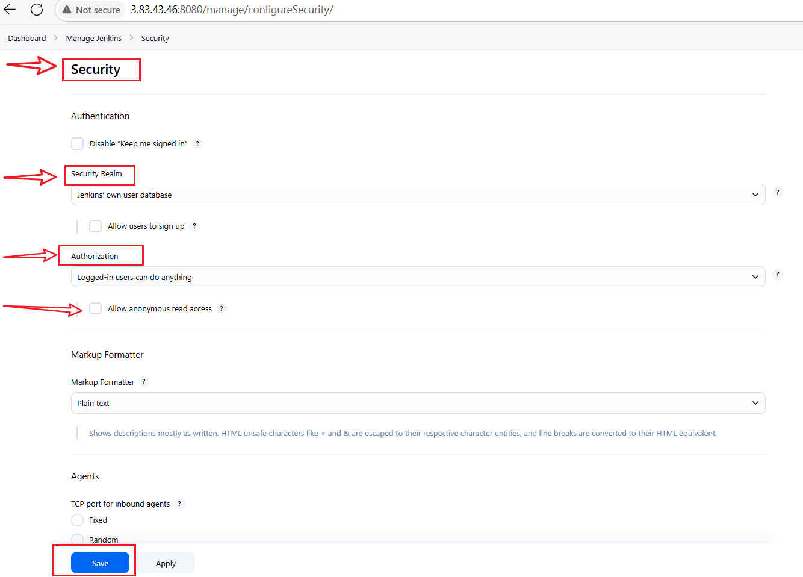


### Basic Jenkins Security

### Fine-tuning Jenkins permissions for better security

+ Manage Jenkins ➜ Configure Global Security
+ Use EC2 security group to limit access to Jenkins port (8080)
+ Enable matrix-based security
+ Administrator (account) → Full access
+ Logged-in Users → Read & View permissions
+ Anonymous Users → No access (Best for security!), Click Save.
+ Regular backups
 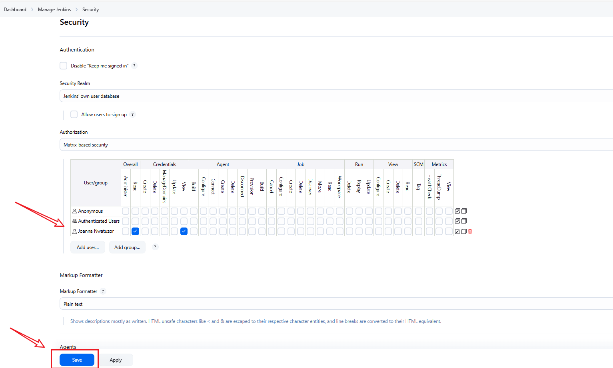

 


### Create Jenkins Credentials

+ Add credentials:

+ AWS credentials (Access Key & Secret)


### Create and Run Jenkins Pipeline 

🔹Create a Pipeline Job

+ In Jenkins Dashboard, click “New Item”

+ Enter a name like helm-capstone

+ Choose Pipeline

+ Click OK


### 🔹Configure the Pipeline


**Pipeline Section:**
**Choose:**

**Definition:** Pipeline script from SCM

**SCM**: Git

**Repository URL:** https://github.com/your-username/your-repo.git

**Credentials:** Select github-cred if private

**Script Path:** Jenkinsfile

Click Save.


### Enable Webhooks in Your GitHub Repository
+ Go to your GitHub repository → Click Settings → Webhooks.

+ Click Add webhook.

+ In the Payload URL, enter:
```
http://your-jenkins-server/github-webhook/
```
+ Replace your-jenkins-server with your actual Jenkins URL.

+ Choose application/json as the content type.

+ Under Events, select:

+ Push events 

+ You can also select pull requests or custom triggers.

+ Click Save.


----
## Step 2: What are Helm and Helm Chart?

### What is Helm?
Helm is a package manager for Kubernetes, like apt for Ubuntu or yum for CentOS. Helm lets you define, install, and upgrade Kubernetes applications using charts.


### What is a Helm Chart?
A Helm chart is a collection of YAML templates that describe a set of Kubernetes resources.


### Why Use Helm Charts?

+ It Simplifies deployment with one command: 
```
helm install
helm version
```

+ Reusable and customizable

+ Supports configuration with values files

+ Manages app lifecycle (upgrade, rollback, uninstall)                                                                                  


### Create a folder for all the app
```
mkdir my-app/helm/
```


### Creating a Basic Helm Chart
```
helm create webapp
```

### This creates folders like:

**Chart.yaml:** chart metadata

**values.yaml:** configurable app values (e.g., image name)

**templates/:** deployment and service YAMLs


### Move Helm Chart Files into a webapp/ Chart Folder

**Run this in your terminal:**
```
mv my-app/helm/Chart.yaml my-app/helm/webapp/
mv my-app/helm/values.yaml my-app/helm/webapp/
mv my-app/helm/templates my-app/helm/webapp/
mv my-app/helm/.helmignore my-app/helm/webapp/
```

### Remove the now-empty charts/
```
rmdir my-app/helm/charts 2>/dev/null
```


## Edit the Chart and Update the Following

**Helm Chart: Chart.yaml**
```
apiVersion: v2
name: my-first-chart
description: A simple Helm chart for web app
version: 0.1.0
appVersion: "1.0"
```


**values.yaml**

```
replicaCount: 2

image:
  repository: <account-id>.dkr.ecr.us-east-1.amazonaws.com/my-first-chart
  tag: latest
  pullPolicy: IfNotPresent

service:
  type: LoadBalancer
  port: 80

resources: {}
```


**templates/deployment.yaml**
```
apiVersion: apps/v1
kind: Deployment
metadata:
  name: {{ include "my-first-chart.fullname" . }}
spec:
  replicas: {{ .Values.replicaCount }}
  selector:
    matchLabels:
      app: {{ include "my-first-chart.name" . }}
  template:
    metadata:
      labels:
        app: {{ include "my-first-chart.name" . }}
    spec:
      containers:
        - name: my-first-chart
          image: "{{ .Values.image.repository }}:{{ .Values.image.tag }}"
          ports:
            - containerPort: 80
```


**templates/service.yaml**
```
apiVersion: v1
kind: Service
metadata:
  name: {{ include "my-first-chart.fullname" . }}
spec:
  type: {{ .Values.service.type }}
  selector:
    app: {{ include "my-first-chart.name" . }}
  ports:
    - port: {{ .Values.service.port }}
      targetPort: 80
```


###  Create a sample HTML file:
On The AWS EC2 Instance Run:
```
mkdir -p my-app/public
cd my-app
aws configure
nano Dockerfile
```

**Paste**
```
# Dockerfile
FROM nginx:alpine
COPY ./public /usr/share/nginx/html
EXPOSE 80
CMD ["nginx", "-g", "daemon off;"]
```


### Create a sample HTML file:
```
nano public/index.html
```

**Paste**
```
<!DOCTYPE html>
<html>
  <head><title>My Custom Web App</title></head>
  <body>
    <h1>Hello from my custom EKS-deployed web app!</h1>
    <p>Deployment successful via Docker, ECR, Helm, and EKS </p>
  </body>
</html>
```


## Build and Push Docker Image to ECR on EC2 Instance

**Authenticate Docker to AWS ECR**
```
aws ecr get-login-password --region us-east-1 | docker login --username AWS --password-stdin <account_id>.dkr.ecr.us-east-1.amazonaws.com
docker build -t webapp .
docker tag webapp:latest <account_id>.dkr.ecr.us-east-1.amazonaws.com/my-webapp:latest
docker push <account_id>.dkr.ecr.us-east-1.amazonaws.com/my-webapp:latest
```


## Docker + ECR Setup 
+ Docker is used to build the web app image and push it to AWS ECR.


### Update Your kubeconfig for EKS On Terminal

Connect your local kubectl to your EKS cluster:
```
aws eks --region us-east-1 update-kubeconfig --name capstone-cluster
```


### Test the connection:
```
kubectl get nodes
kubectl get pods
```
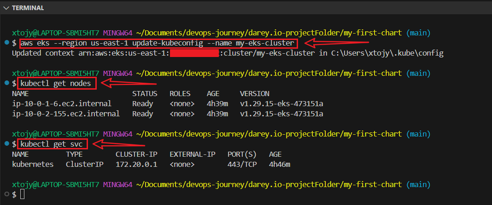


### Deploy with Helm

**Run on Project Root**
```
helm upgrade --install web-app ./helm/webapp \
--set image.repository=<account-id>.dkr.ecr.us-east-1.amazonaws.com/my-webapp \
--set image.tag=latest
```

## Verify Deployment
```
kubectl get svc -w
```
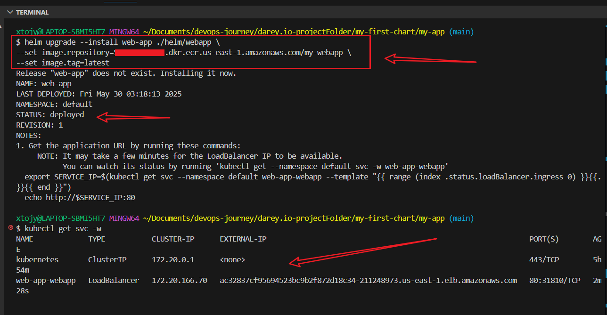


### Verify the Deployment

### a. Get All Kubernetes Resources
```
kubectl get all
```

### b. Get LoadBalancer External IP
```
kubectl get svc
```


### Test the Web App
Open in your browser:

```
http://<EXTERNAL-IP>
```
OR

```
http://<LoadBalancer-DNS>
```
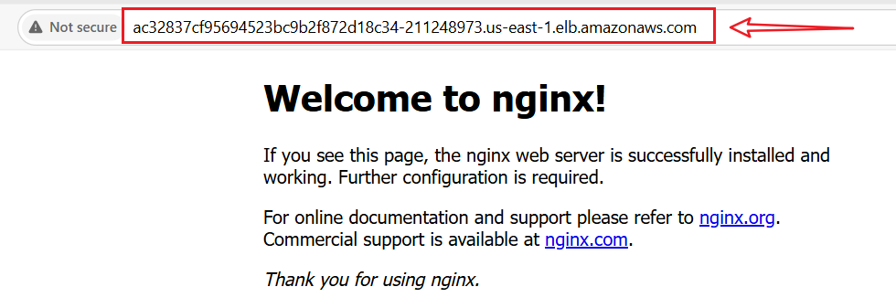


### Upgrade helm

+ **Update values.yaml**
```
image:
  repository: <account-id>.dkr.ecr.us-east-1.amazonaws.com/my-webapp
  tag: latest         
  pullPolicy: IfNotPresent
```

+ **Rebuild docker image and push**
**run**
```
 docker tag <account-id>.dkr.ecr.us-east-1.amazonaws.com/my-webapp:latest <account-id>.dkr.ecr.us-east-1.amazonaws.com/my-webapp:latest
docker push <account-id>.dkr.ecr.us-east-1.amazonaws.com/my-webapp:latest
```


### Use Helm Chart in Jenkins Pipeline
On Jenkinsfile :

+ Log into AWS ECR

+ Builds and pushes image

+ Runs Helm upgrade


```
aws ecr get-login-password --region us-east-1 | docker login --username AWS --password-stdin <account_id>.dkr.ecr.us-east-1.amazonaws.com
docker build -t web-app .
docker tag web-app:latest <account_id>.dkr.ecr.us-east-1.amazonaws.com/web-app:latest
docker push <account_id>.dkr.ecr.us-east-1.amazonaws.com/web-app:latest 
```

----


## Test Web App via EKS LoadBalancer DNS
### On Terminal:
**Run**
```
aws eks update-kubeconfig --region us-east-1 --name capstone-eks
helm list
kubectl get nodes
kubectl get svc
```


## Step 3: Deploying the App with Helm

### Package and Deploy

+ ## upgrade Helm
```
cd my-app/
```

+ **Validate your chart**
**Run:**
```
helm lint .
```

**Run**
```
helm upgrade web-app ./helm/webapp \
  --set image.repository=<account-id>.dkr.ecr.us-east-1.amazonaws.com/my-webapp \
  --set image.tag=v3
```
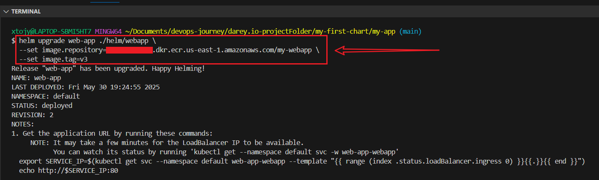


### Verify after deploying:
```
kubectl get pods
kubectl get svc
```
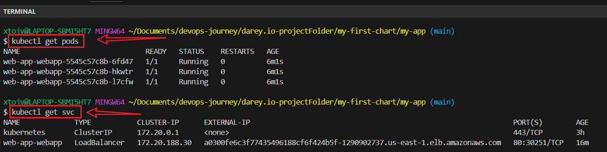


### Check Log 
```
kubectl logs web-app-webapp-5545c57c8b-6fd47
```
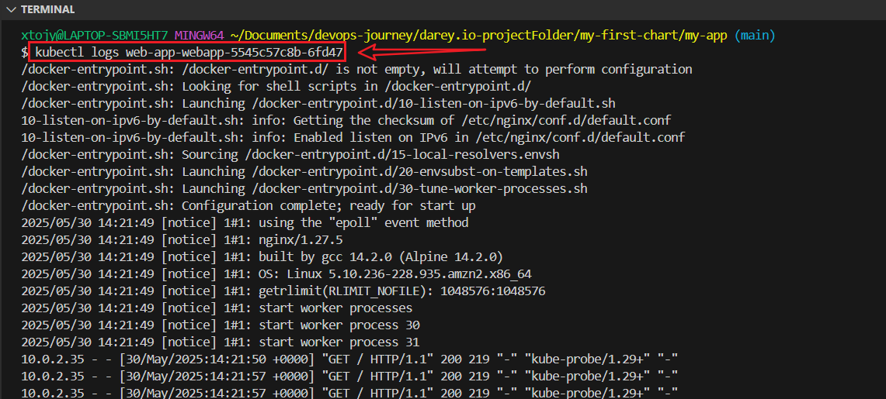


### Accessing webapp on Terminal 
**Port forward**
```
kubectl get pods
kubectl port-forward pod/web-app-webapp-5545c57c8b-6fd47 9090:80
```
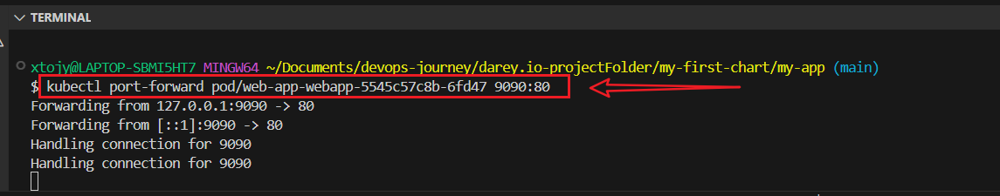


### On Browser
```
http://localhost:9090
```
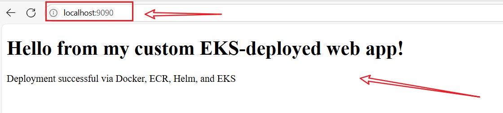


### Accessing webapp via Load Balancer on Terminal
```
kubectl get svc
kubectl get pods
curl http://a1753a612076c4bc4aa6711f0df09b8c-259451018.us-east-1.elb.amazonaws.com
```
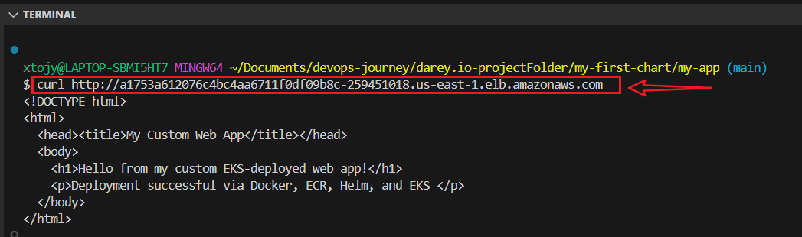


### Load Balancer On Browser
```
http://a1753a612076c4bc4aa6711f0df09b8c-259451018.us-east-1.elb.amazonaws.com
```
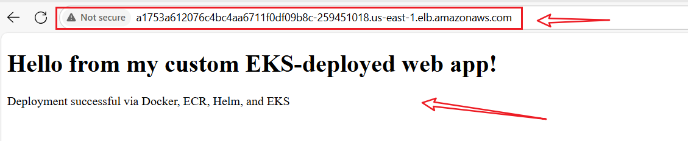


### Access the application and Port forward

Use kubectl port-forward to test locally:
```
kubectl get service web-app-webapp
kubectl port-forward service/web-app-webapp 8090:80
```
Then access app at:
```
http://localhost:8090
```
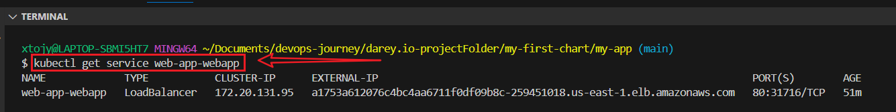
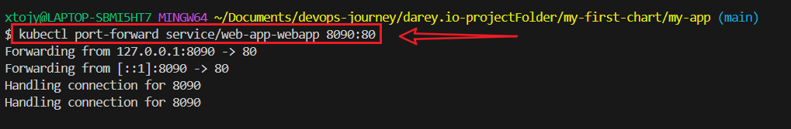
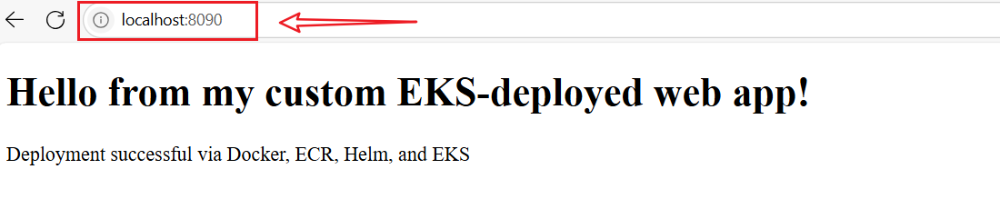


----

### Watch rollout status of your deployment:
```
kubectl rollout status deployment/web-app-webapp
helm history web-app
```
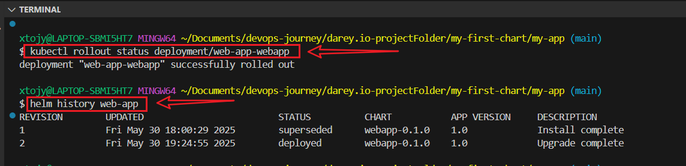


## Roll Back a Helm Release
```
helm rollback web-app 1
helm history web-app
```
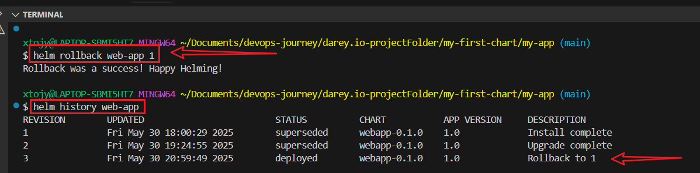


----


## Step 4: Understanding Templates & Values

**values.yaml**

You can override anything from values.yaml at runtime:

```
helm install web-app ./web-app --set replicaCount=3
```

### Templating
Files in **templates/** use Go templating:

```
image: "{{ .Values.image.repository }}:{{ .Values.image.tag }}"
```

----


## Step 5: Integrating Helm with Jenkins

+ **Goal**

Automatically deploy the app to EKS using Helm from Jenkins when code is pushed.        

### Verify Jenkins Integration Inside Jenkins:

```
aws eks list-clusters
helm list --all --namespace default
```


## Add AWS Credentials in Jenkins
+ Go to: Jenkins > Manage Jenkins > Credentials

+ Add AWS_ACCESS_KEY_ID and AWS_SECRET_ACCESS_KEY as Username/Password credentials

+ Give ID: aws-cred


### 🔹Run the Pipeline

+ On every Push to Github

+ Watch console output for stages:

+ Checkout

+ Build Docker image

+ Push to ECR

+ Deploy with Helm


### Destroy Infrastructure
```
terraform destroy
```

## Commit and Push Your Helm Chart to GitHub
```
git add .
git commit -m "update file"
git push 
```


## Conclusion

This project offers a practical demonstration of using Helm and Jenkins to manage Kubernetes-based application deployments. By containerizing the app and orchestrating the CI/CD pipeline with Jenkins, this setup achieves full automation from code push to deployment on EKS.

With Helm handling application releases, and Jenkins controlling the CI/CD pipeline, the process becomes efficient, scalable, and production-ready.


### Author

**Joy Nwatuzor**

**DevOps Engineer**