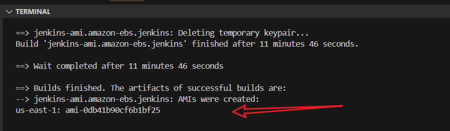

# Configuration Management With Helm

> Automating the CI/CD pipeline of a sample web application using Jenkins, Helm, EKS, ECR, and Terraform on AWS.

---


## Project Overview

This project demonstrates how to:
- Provision infrastructure using Terraform
- Install Jenkins on an EC2 instance
- Use **Amazon ECR** for storing Docker images
- Deploy applications to Amazon EKS using Helm
- Automate the entire process using a CI/CD pipeline


---


## Architecture

```
+----------------+      +------------------+      +--------------------+
|   Developer    | ---> |   GitHub Repo    | ---> |   Jenkins EC2 VM   |
+----------------+      +------------------+      +---------+----------+
                                                     |
                                                     v
                                              Docker Build + Push
                                                to Amazon ECR
                                                     |
                                                     v
                                             Helm Deploy to EKS
                                                     |
                                                     v
                                               App Live on EKS

```

---


## Features
+ Jenkins auto-installs with Helm, Docker, kubectl

+ EC2 and EKS infrastructure provisioned with Terraform

+ CI/CD pipeline triggered on GitHub push

+ Docker images pushed to Amazon ECR

+ Helm chart templates deployed to EKS

+ Credentials and security scoped for DevOps best practices


---


## Project Structure
```
project-root/
MY-FIRST-CHART/
│
├── jenkins-ami/
│   ├── setup.sh
│   └── packer.pkr.hcl
├── terraform/                # Infrastructure code
│   ├── main.tf
│   ├── variables.tf
│   ├── outputs.tf
│   ├── terraform.tfvars
│
├── helm-chart/
│   └── my-first-chart/
│       ├── Chart.yaml
│       ├── templates/
│       │   ├── deployment.yaml
│       │   ├── service.yaml
│       │   └── ingress.yaml
│       └── values.yaml
│
├── Jenkinsfile               # CI/CD Pipeline
├── README.md                 # Project documentation
└── .gitignore
```

---


## Tools & Technologies

- **Jenkins** — CI/CD automation
- **Helm** — Kubernetes package manager
- **Terraform** — Infrastructure as code (EC2, ECR, EKS provisioning)
- **DockerHub** — Container image build & hosting
- **AWS EC2** — Jenkins host
- **AWS EKS** — Kubernetes cluster for deployments

---


## Pre-requisites
+ AWS IAM User with programmatic access and EKS permissions

+ AWS CLI configured locally

+ Terraform CLI

+ GitHub account + personal repo

+ Jenkins plugins:

+ Git

+ Kubernetes CLI

+ Docker Pipeline

+ Helm

+ AWS Credentials


---

## Step-by-Step Guide

### Create project directory
```
mkdir my-first-chart
cd my-first-chart
```


## Install Packer on Windows
```
choco install packer
packer version
```


## Create Folder for Jenkins Ami
+ Create directory
+ Paste your user-data bash script inside setup.sh.

```
mkdir jenkins-ami && cd jenkins-ami
touch setup.sh
```

**Paste**
```
#!/bin/bash
set -e
exec > >(tee /tmp/setup.log|logger -t user-data -s 2>/dev/console) 2>&1

echo "Updating packages..."
sudo apt-get update -y && sudo apt-get upgrade -y

# 1. Java
echo "Installing Java..."
sudo add-apt-repository universe -y
sudo add-apt-repository multiverse -y
sudo apt-get update -y
sudo apt install openjdk-17-jre -y
java -version || { echo "Java installation failed!"; exit 1; }

# 2. Jenkins
echo "Installing Jenkins..."
curl -fsSL https://pkg.jenkins.io/debian-stable/jenkins.io-2023.key | sudo tee \
    /usr/share/keyrings/jenkins-keyring.asc > /dev/null
echo deb [signed-by=/usr/share/keyrings/jenkins-keyring.asc] \
    https://pkg.jenkins.io/debian-stable binary/ | sudo tee \
    /etc/apt/sources.list.d/jenkins.list > /dev/null
sudo apt-get update
sudo apt-get install jenkins -y
sudo chown -R jenkins:jenkins /var/lib/jenkins
sudo systemctl enable jenkins
sudo systemctl start jenkins
sudo systemctl status jenkins || { echo "❌ Jenkins failed to start!"; exit 1; }

# 3. Docker
echo "Installing Docker..."
sudo apt-get install ca-certificates curl gnupg -y
sudo install -m 0755 -d /etc/apt/keyrings
curl -fsSL https://download.docker.com/linux/ubuntu/gpg | sudo gpg --dearmor -o /etc/apt/keyrings/docker.gpg
sudo chmod a+r /etc/apt/keyrings/docker.gpg
echo \
  "deb [arch=$(dpkg --print-architecture) signed-by=/etc/apt/keyrings/docker.gpg] https://download.docker.com/linux/ubuntu \
  $(. /etc/os-release && echo "$VERSION_CODENAME") stable" | \
  sudo tee /etc/apt/sources.list.d/docker.list > /dev/null
sudo apt-get update
sudo apt-get install docker-ce docker-ce-cli containerd.io docker-buildx-plugin docker-compose-plugin -y
docker --version || { echo "❌ Docker installation failed!"; exit 1; }

sudo usermod -aG docker ubuntu
sudo usermod -aG docker jenkins

# 4. AWS CLI
echo "Installing AWS CLI..."
curl "https://awscli.amazonaws.com/awscli-exe-linux-x86_64.zip" -o "awscliv2.zip"
sudo apt install unzip -y
unzip awscliv2.zip || { echo "Unzip failed"; exit 1; }
sudo ./aws/install
aws --version
rm -rf aws awscliv2.zip

# 5. Helm
echo "Installing Helm..."
curl -LO https://get.helm.sh/helm-v3.14.2-linux-amd64.tar.gz
tar -zxvf helm-v3.14.2-linux-amd64.tar.gz
sudo install -m 755 linux-amd64/helm /usr/local/bin/helm
rm -rf linux-amd64 helm-v3.14.2-linux-amd64.tar.gz
helm version || { echo "❌ Helm installation failed!"; exit 1; }

# 6. Kubectl
echo "Installing kubectl..."
curl -LO "https://dl.k8s.io/release/$(curl -sL https://dl.k8s.io/release/stable.txt)/bin/linux/amd64/kubectl"
sudo install -o root -g root -m 0755 kubectl /usr/local/bin/kubectl
kubectl version --client

echo "✅ Jenkins + Docker + Helm + kubectl are installed"
```

+ Make it executable:
```
chmod +x setup.sh 
```


## Create the Packer Template
+ Create a Packer template file called packer.pkr.hcl:
```
touch packer.pkr.hcl
```

**Paste:**
```
packer {
  required_plugins {
    amazon = {
      version = ">= 1.0.0"
      source  = "github.com/hashicorp/amazon"
    }
  }
}

variable "aws_region" {
  default = "us-east-1"
}

variable "source_ami" {
  default = "ami-0f9de6e2d2f067fca"
}

variable "instance_type" {
  default = "t2.medium"
}

source "amazon-ebs" "jenkins" {
  region                      = var.aws_region
  source_ami                  = var.source_ami
  instance_type               = var.instance_type
  ssh_username                = "ubuntu"
  ami_name                    = "jenkins-ami-{{timestamp}}"
  associate_public_ip_address = true
  communicator                = "ssh"
}

build {
  name = "jenkins-ami"

  sources = [
    "source.amazon-ebs.jenkins"
  ]

  provisioner "file" {
    source      = "setup.sh"
    destination = "/tmp/setup.sh"
  }

  provisioner "shell" {
    inline = [
      "chmod +x /tmp/setup.sh",
      "sudo /tmp/setup.sh"
    ]
  }
}
```

## Build Your AMI
+ Verify AWS CLI configuration

**Run**
```
aws configure
packer init .
packer validate packer.pkr.hcl
packer build packer.pkr.hcl
```
**go to your AWS Console → EC2 → AMIs to see new AMI ID**




### Create .gitignore

Create a .gitignore file in the root of your project:

 ```
 touch .gitignore
 ```

#### Paste the following into it:
```
# Terraform
*.tfstate
*.tfstate.*
.terraform/
.crash
*.tfvars
*.tfvars.json
override.tf
override.tf.json
terraform.tfstate.backup
.terraform.lock.hcl

# Packer
packer_cache/
*.pkr.hcl.lock
*.pkrvars.hcl
setup-debug.log

# User data scripts
*.log
*.zip
*.bak

# System
.DS_Store
Thumbs.db

# IDEs/editors
.vscode/
.idea/
*.swp
*.swo

# Credentials
*.pem
*.key
.aws/
```


### Git initialization and Push:

+ Create a repo on github

```
git init
git add .gitignore
git add .
git commit -m "Initial project setup with Terraform"
git branch -m master main
git remote add origin https://github.com/yourusername/your-repository.git
git push -u origin main
git status
```


### Step 1: Use Terraform to Set Up AWS Resources
+ Create project folders
+ AWS CLI installed + configured
+ verify terraform installation

```
cd ..
mkdir terraform
cd terraform
aws configure
terraform -v
```


### Create terraform/main.tf
touch main.tf
```
provider "aws" {
  region = var.region
}

# 1. Security Group for Jenkins EC2
resource "aws_security_group" "jenkins_sg" {
  name        = "jenkins-sg"
  description = "Allow SSH, HTTP, and Jenkins access"
  vpc_id      = var.vpc_id

  ingress {
    from_port   = 22
    to_port     = 22
    protocol    = "tcp"
    cidr_blocks = ["0.0.0.0/0"]
  }

  ingress {
    from_port   = 80
    to_port     = 80
    protocol    = "tcp"
    cidr_blocks = ["0.0.0.0/0"]
  }

  ingress {
    from_port   = 8080
    to_port     = 8080
    protocol    = "tcp"
    cidr_blocks = ["0.0.0.0/0"]
  }

  egress {
    from_port   = 0
    to_port     = 0
    protocol    = "-1"
    cidr_blocks = ["0.0.0.0/0"]
  }

  tags = {
    Name = "JenkinsSecurityGroup"
  }
}

# 2. Jenkins EC2 Instance
resource "aws_instance" "jenkins_server" {
  ami                         = var.ami_id
  instance_type               = "t2.micro"
  key_name                    = var.key_name
  vpc_security_group_ids      = [aws_security_group.jenkins_sg.id]
  subnet_id                   = var.subnet_ids[0]
  associate_public_ip_address = true
  iam_instance_profile        = aws_iam_instance_profile.jenkins_instance_profile.name
  
  tags = {
    Name = "JenkinsServer"
  }

  user_data = file("jenkins/install_jenkins.sh")
}

# 3. ECR Repository
resource "aws_ecr_repository" "web_app_repo" {
  name = var.ecr_repository_name
}

# 4. EKS Cluster
module "eks" {
  source          = "terraform-aws-modules/eks/aws"
  cluster_name    = var.cluster_name
  cluster_version = var.cluster_version
  subnet_ids      = var.subnet_ids
  vpc_id          = var.vpc_id
  enable_irsa     = true
}
```

### terraform/variable.tf
touch variable.tf
```
variable "region" {
  description = "AWS region to deploy resources in"
  type        = string
  default     = "us-east-1"
}

variable "key_name" {
  description = "Name of the SSH key pair to use for EC2"
  type        = string
}

variable "vpc_id" {
  description = "VPC ID for the EKS cluster"
  type        = string
}

variable "subnet_ids" {
  description = "List of subnet IDs for the EKS cluster"
  type        = list(string)
}

variable "ecr_repository_name" {
  description = "Name of the ECR repository for the application"
  type        = string
  default     = "web-app"
}

variable "ami_id" {
  description = "AMI ID for Jenkins EC2 instance"
  type        = string
  default     = "ami-084568db4383264d4"
}

variable "cluster_name" {
  description = "Name of the EKS cluster"
  type        = string
  default     = "capstone-eks"
}

variable "cluster_version" {
  description = "Kubernetes version for EKS"
  type        = string
  default     = "1.24"
}
```

### terraform/output.tf
touch output.tf
```
output "jenkins_public_ip" {
  description = "Public IP of the Jenkins EC2 instance"
  value       = aws_instance.jenkins_server.public_ip
}

output "ecr_repository_url" {
  description = "URL of the ECR repository"
  value       = aws_ecr_repository.web_app_repo.repository_url
}

output "eks_cluster_name" {
  description = "Name of the EKS cluster"
  value       = module.eks.cluster_name
}
```


### terraform/terraform.tfvars
touch terraform.tfvars
```
region                        = "us-east-1"
key_name                      = "main-key"
vpc_id                        = "vpc-0b75f6b3ee6f897f4"
subnet_ids                    = ["subnet-0cadb9f6fe9ad4229", "subnet-05f028de633ab9751"]
ecr_repository_name           = "web-app"
ami_id                        = "ami-0db41b90cf6b1bf25"
cluster_name                  = "capstone-eks"
cluster_version               = "1.29"
jenkins_iam_role_name         = "jenkins-ec2-role"
jenkins_policy_name           = "jenkins-ec2-policy"
jenkins_instance_profile_name = "jenkins-instance-profile"
```

----


### Create iam.tf: IAM Role, Policy, and Instance Profile

```
touch iam.tf
```

**Paste**
```
resource "aws_iam_role" "jenkins_ec2_role" {
  name = "jenkins-ec2-role"

  assume_role_policy = jsonencode({
    Version = "2012-10-17"
    Statement = [
      {
        Action = "sts:AssumeRole"
        Principal = {
          Service = "ec2.amazonaws.com"
        }
        Effect = "Allow"
        Sid    = ""
      }
    ]
  })
}

resource "aws_iam_policy" "jenkins_policy" {
  name        = "jenkins-ec2-policy"
  description = "Policy to allow EKS, S3, and CloudWatch access"

  policy = jsonencode({
    Version = "2012-10-17"
    Statement = [
      {
        Effect = "Allow"
        Action = [
          "eks:DescribeCluster",
          "eks:ListClusters",
          "eks:DescribeNodegroup",
          "eks:ListNodegroups",
          "sts:GetCallerIdentity",
          "cloudwatch:*",
          "logs:*",
          "s3:*"
        ]
        Resource = "*"
      }
    ]
  })
}

resource "aws_iam_role_policy_attachment" "jenkins_role_policy_attach" {
  role       = aws_iam_role.jenkins_ec2_role.name
  policy_arn = aws_iam_policy.jenkins_policy.arn
}

resource "aws_iam_instance_profile" "jenkins_instance_profile" {
  name = "jenkins-instance-profile"
  role = aws_iam_role.jenkins_ec2_role.name
}
```


### Create Jenkins file and directory 
+ Run
```
mkdir -p jenkins
touch jenkins/install_jenkins.sh
```

### Paste
```
#!/bin/bash
export HOME=/home/ubuntu
aws eks update-kubeconfig --region us-east-1 --name capstone-eks
cp -r ~/.kube /var/lib/jenkins/
chown -R jenkins:jenkins /var/lib/jenkins/.kube
echo "KUBECONFIG=/var/lib/jenkins/.kube/config" >> /etc/default/jenkins
systemctl restart jenkins
```


### Make the Shell Script Executable
In your terminal, navigate to the root of your Terraform project, then run:
```
chmod +x jenkins/install_jenkins.sh
```


### Initialize and Apply
```
terraform init
terraform validate
terraform plan 
terraform apply 
```


## Step 2: Open Jenkins Dashboard

+ Restart instance or log out and log back in to apply docker group changes.

+ Test Jenkins by checking the service:
```
sudo systemctl status jenkins
docker ps
helm version
kubectl version --client
```

+ Open your web browser and go to:
```
http://<JENKINS_PUBLIC_IP>:8080
```

+ You’ll see a page asking for a secret password.

+ Get it from your terminal:

```
sudo cat /var/lib/jenkins/secrets/initialAdminPassword
```
+ Paste it into the Jenkins UI (browser)

+ Choose “Install suggested plugins”

+ Create admin user (or skip)


## Install Plugins
🔹 Install Plugins in Jenkins

1️⃣ Go to Manage Jenkins → Plugins → Available Plugins 

2️⃣ Search and install these plugins:

+ Git Plugin (for Git integration)

+ Pipeline Plugin (for CI/CD automation)

+ Docker Commons

+ Kubernetes CLI Plugin (for Helm & Kubernetes)

+ Helm Plugin (for Helm chart deployments)

+ Credentials Binding Plugin (for secure credentials management)


### Restart Jenkins after installing plugins:

```
sudo systemctl restart jenkins
```


## Add Basic Security 

+ Go to Manage Jenkins > Configure Global Security

+ Create a new admin user.

+ Disable "Allow anonymous read access.                                                                 
+ Save your changes.


### Fine-tuning Jenkins permissions for better security

+ Enable matrix-based security
+ Administrator (account) → Full access
+ Logged-in Users → Read & View permissions
+ Anonymous Users → No access (Best for security!), Click Save.
 

 
### Create Jenkins Credentials

Go to: Manage Jenkins → Credentials → (Global) → Add Credentials

🔹 DockerHub Credentials

**Field**      **Value**

Type      :   Username with Password

ID	      :  dockerhub-creds

Username	:  your DockerHub username

Password	:  your DockerHub password


### Create and Run Jenkins Pipeline 

🔹Create a Pipeline Job

+ In Jenkins Dashboard, click “New Item”

+ Enter a name like helm-capstone

+ Choose Pipeline

+ Click OK


### 🔹Configure the Pipeline


**Pipeline Section:**
**Choose:**

**Definition:** Pipeline script from SCM

**SCM**: Git

**Repository URL:** https://github.com/your-username/your-repo.git

**Credentials:** Select github-creds if private

**Script Path:** jenkins-pipeline/Jenkinsfile

Click Save.

## Create Jenkinsfile
**Paste**
```
pipeline {
    agent any

    environment {
        AWS_DEFAULT_REGION = 'us-east-1'
        DOCKERHUB_IMAGE = 'joanna2/web-app:latest'
        ECR_REPO = '586794450782.dkr.ecr.us-east-1.amazonaws.com/web-app'
    ECR_IMAGE = "${ECR_REPO}:latest"
    }

    triggers {
        githubPush()
    }

    stages {
        stage('Build and Push Docker Image') {
            steps {
                withCredentials([
                    usernamePassword(
                        credentialsId: 'dockerhub-creds',
                        usernameVariable: 'DOCKER_USERNAME',
                        passwordVariable: 'DOCKER_PASSWORD'
                    ),
                    usernamePassword(
                        credentialsId: 'aws-cred',
                        usernameVariable: 'AWS_ACCESS_KEY_ID',
                        passwordVariable: 'AWS_SECRET_ACCESS_KEY'
                    )
                ]) {
                    sh '''
                        echo "Building Docker image..."
                        docker build -t $DOCKERHUB_IMAGE -t $ECR_IMAGE .

                        echo "Logging in to Docker Hub..."
                        echo $DOCKER_PASSWORD | docker login -u $DOCKER_USERNAME --password-stdin

                        echo "Pushing image to Docker Hub..."
                        docker push $DOCKERHUB_IMAGE

                        echo "Logging in to AWS ECR..."
                        aws configure set aws_access_key_id $AWS_ACCESS_KEY_ID
                        aws configure set aws_secret_access_key $AWS_SECRET_ACCESS_KEY
                        aws configure set default.region $AWS_DEFAULT_REGION

                        aws ecr get-login-password --region $AWS_DEFAULT_REGION | docker login --username AWS --password-stdin $ECR_REPO

                        echo "Pushing image to AWS ECR..."
                        docker push $ECR_IMAGE

                        echo "Cleaning up local images..."
                        docker rmi $DOCKERHUB_IMAGE $ECR_IMAGE || true
                    '''
                }
            }
        }

        stage('Deploy with Helm') {
            when {
                expression {
                    env.GIT_BRANCH == 'origin/main' || env.GIT_BRANCH == 'origin/develop'
                }
            }
            steps {
                withCredentials([
                    usernamePassword(
                        credentialsId: 'aws-cred',
                        usernameVariable: 'AWS_ACCESS_KEY_ID',
                        passwordVariable: 'AWS_SECRET_ACCESS_KEY'
                    )
                ]) {
                    sh '''
                        export AWS_ACCESS_KEY_ID=$AWS_ACCESS_KEY_ID
                        export AWS_SECRET_ACCESS_KEY=$AWS_SECRET_ACCESS_KEY

                        echo "Configuring access to EKS..."
                        aws eks --region ${AWS_DEFAULT_REGION} update-kubeconfig --name my-eks-cluster

                        echo "Deploying to EKS with Helm..."
                        helm upgrade --install my-webapp ./webapp --namespace default --set image.repository=$ECR_REPO,image.tag=latest
                    '''
                }
            }
        }
    }
}
```


### 🔹Run the Pipeline

On Push to Github

Watch console output for stages:

+ Checkout

+ Build Docker image

+ Push to DockerHub

+ Deploy with Helm


## Create Dockerfile For a React App (Static Build)
```
nano Dockerfile 
```

**Paste**
```
# Use Nginx as the base image
FROM nginx:stable

# Copy your web app files into the Nginx HTML directory
COPY . /usr/share/nginx/html

# Expose port 80
EXPOSE 80

# Start Nginx
CMD ["nginx", "-g", "daemon off;"]
```

## Create .dockerignore File

**Paste**
```
*.tar
*.zip
*.log
node_modules
.vscode
.git
*.lz4
```

### On The Instance Run:
```
docker login -u username -p password
docker build -t <your-dockerhub-username>/<your-image-name>:<tag> .
docker push <your-dockerhub-username>/<your-image-name>:<tag> 
```


## Step 2: What are Helm Charts?

### What is Helm?
Helm is a package manager for Kubernetes, similar to apt for Ubuntu or yum for CentOS.

+ It helps to define, install, and manage Kubernetes applications.

+ Helm uses charts — packages of pre-configured Kubernetes resources.


### What is a Helm Chart?
A Helm chart is a collection of files that describe a related set of Kubernetes resources.


### Why Use Helm Charts?

+ Simplifies deployment with one command: 
```
helm install
helm version
```

+ Reusable and customizable

+ Supports configuration with values files

+ Manages app lifecycle (upgrade, rollback, uninstall)                                                                                                                                   


###  Create First Helm Chart

Install and Verify Helm 
```
helm version
```

```
helm create my-first-chart
cd my-first-chart
```
#### This creates:

**Chart.yaml:** chart metadata

**values.yaml:** configurable app values (e.g., image name)

**templates/:** deployment and service YAMLs


### Simplify the contents.

+ Update values.yaml

Edit the image to use Nginx:
```
image:
  repository: nginx
  pullPolicy: IfNotPresent
  tag: latest

replicaCount: 1
```

### Edit templates/deployment.yaml
Reference the values properly:
```
spec:
  replicas: {{ .Values.replicaCount }}
  template:
    spec:
      containers:
        - name: {{ .Chart.Name }}
          image: "{{ .Values.image.repository }}:{{ .Values.image.tag }}"
```

### Add a simple Service

**templates/service.yaml**
```
apiVersion: v1
kind: Service
metadata:
  name: {{ include "my-first-chart.fullname" . }}
spec:
  type: ClusterIP
  ports:
    - port: 80
      targetPort: 80
  selector:
    app.kubernetes.io/name: {{ include "mywebapp.name" . }}
```


### helm-chart/templates/deployment.yaml
```
apiVersion: apps/v1
kind: Deployment
metadata:
  name: {{ include "web-app.fullname" . }}
spec:
  replicas: {{ .Values.replicaCount }}
  selector:
    matchLabels:
      app: {{ include "web-app.name" . }}
  template:
    metadata:
      labels:
        app: {{ include "web-app.name" . }}
    spec:
      containers:
        - name: {{ .Chart.Name }}
          image: "{{ .Values.image.repository }}:{{ .Values.image.tag }}"
          ports:
            - containerPort: 80
```


## Helm Chart — helm-chart/

**Run** 
```
helm create helm-chart
```
then replace these files:

### 🔹 helm-chart/Chart.yaml
```
apiVersion: v2
name: web-app
description: A Helm chart for a simple web app
version: 0.1.0
appVersion: "1.0"
```

### 🔹 helm-chart/values.yaml
```
replicaCount: 1

image:
  repository: devstudent/web-app
  tag: latest
  pullPolicy: IfNotPresent

service:
  type: LoadBalancer
  port: 80

resources: {}

nodeSelector: {}
tolerations: []
affinity: {}
```

## 🔹 helm-chart/templates/deployment.yaml
```
apiVersion: apps/v1
kind: Deployment
metadata:
  name: {{ include "web-app.fullname" . }}
spec:
  replicas: {{ .Values.replicaCount }}
  selector:
    matchLabels:
      app: {{ include "web-app.name" . }}
  template:
    metadata:
      labels:
        app: {{ include "web-app.name" . }}
    spec:
      containers:
        - name: {{ .Chart.Name }}
          image: "{{ .Values.image.repository }}:{{ .Values.image.tag }}"
          ports:
            - containerPort: 80
```

## 🔹 helm-chart/templates/service.yaml
```
apiVersion: v1
kind: Service
metadata:
  name: {{ include "web-app.fullname" . }}
spec:
  type: {{ .Values.service.type }}
  ports:
    - port: {{ .Values.service.port }}
      targetPort: 80
  selector:
    app: {{ include "web-app.name" . }}
```

## Jenkins Pipeline — jenkins-pipeline/Jenkinsfile
```
pipeline {
  agent any
  environment {
    DOCKER_IMAGE = "devstudent/web-app:latest"
  }
  stages {
    stage('Checkout Code') {
      steps {
        git 'https://github.com/your-username/your-repo'
      }
    }

    stage('Build Image') {
      steps {
        sh 'docker build -t $DOCKER_IMAGE ./app'
      }
    }

    stage('Push to DockerHub') {
      steps {
        withCredentials([usernamePassword(credentialsId: 'dockerhub-creds', usernameVariable: 'DOCKER_USER', passwordVariable: 'DOCKER_PASS')]) {
          sh 'echo $DOCKER_PASS | docker login -u $DOCKER_USER --password-stdin'
          sh 'docker push $DOCKER_IMAGE'
        }
      }
    }

    stage('Deploy to EKS with Helm') {
      steps {
        sh 'helm upgrade --install web-app ./helm-chart --set image.repository=devstudent/web-app --set image.tag=latest'
      }
    }
  }
}
``` 

